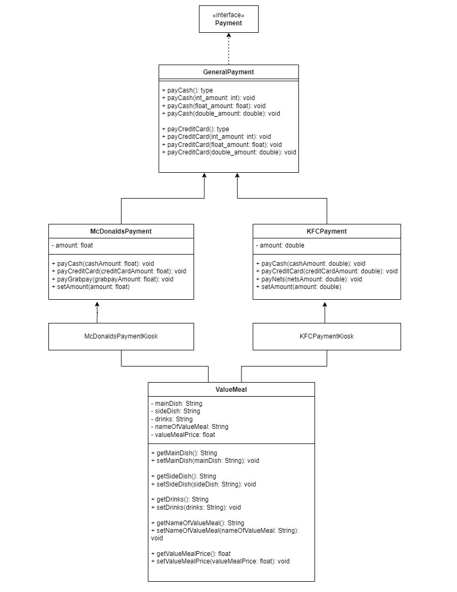

# PaymentApp_Java_OOP
This is a simple payment application that shows my understanding on the concepts of OOP in Java programming language.

Click on the link below to view the better resolution payment UML diagram.

[Payment UML Diagram](Payment_UML_Diagram.pdf)

## Inheritance:
GenernalPayment class implements the Payment Interface to inherit the Payment methods.

## Polymorphism:
Each payment method ( payCash() & payCreditCard() ) in the GeneralPayment class is repeated with different signatures. This is to allow the individual fastfood restaurant to cater to their own implementations.

The McDonaldsPayment class and KFCPayment class extends the GeneralPayment class and they are of two different forms of the GeneralPayment.

## Encapsulation:

